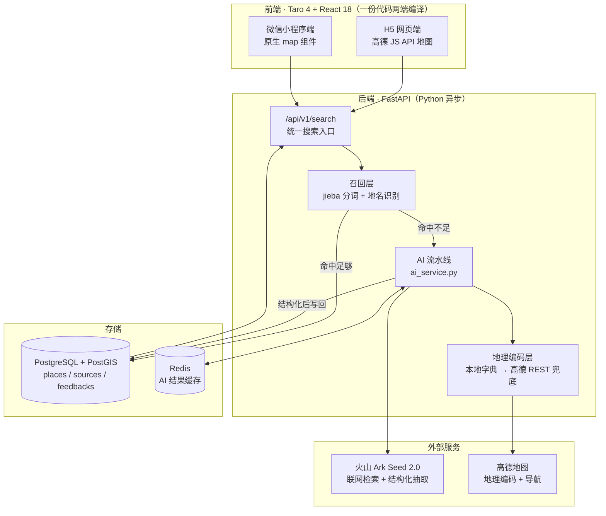
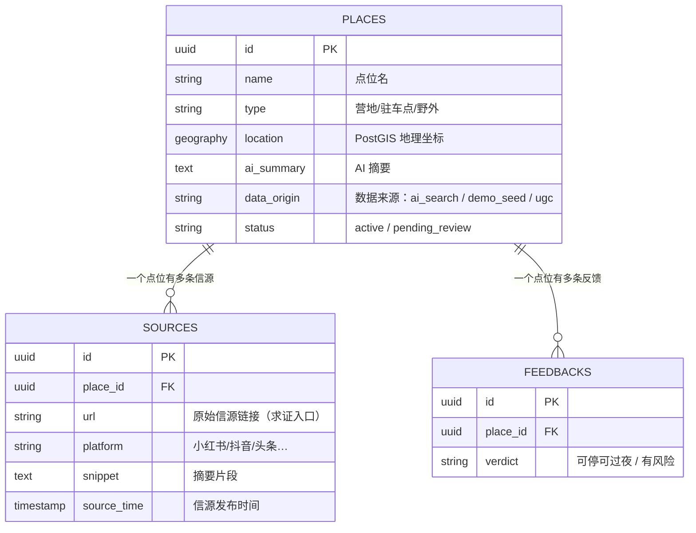

# 技术方案 · AI 驻车露营情报助手

> 版本：2026-08-12（对应 spec-017 之后的代码现状）
> 面向：想读懂这个项目怎么搭起来的人——助教、学生、技术面试官
> 前置阅读：[需求对齐说明_V2.md](../需求对齐说明_V2.md)（产品要什么），本文只讲**怎么实现**

---

## 一、一句话架构

**用户输入一句自然语言 → 先查自己的数据库，查得到就秒回；查不到才花钱调 AI 联网找 → AI 找到的东西结构化后存进自己的数据库 → 下一个人搜同类问题就变成秒回。**

这个设计的名字叫 **cache-first hybrid retrieval**（缓存优先的混合检索）。

**生活比喻**：像一家餐厅的备菜。客人点常见菜（数据库里有）直接出餐；点没见过的菜，厨师现去市场采购（调 AI 联网）、洗切备好（结构化抽取）、上桌的同时**把处理好的半成品存进冰箱**。开得越久，冰箱越满，能秒出的菜越多。

---

## 二、系统全景

---

## 三、一次搜索请求的完整旅程

这是理解整个系统的**主线**。以用户搜「莫干山附近的营地」为例：

| 阶段 | 发生了什么 | 代码位置 | 典型耗时 |
|---|---|---|---|
| ① 分词 | jieba 把中文切成 `莫干山 / 附近 / 营地`（不切词就没法做关键词匹配） | `routers/search.py` | < 10ms |
| ② 地名识别 | 从 query 里认出「莫干山」是地名 → 搜索中心从默认的杭州挪到莫干山 | `routers/search.py` | < 10ms |
| ③ 地理编码 | 「莫干山」→ 经纬度。先查**本地地名字典**，查不到才调高德 REST 接口 | `services/amap_service.py` | 0-200ms |
| ④ 查库 | 按关键词 + 地理半径查 PostGIS。命中数 ≥ 阈值（请求 limit 的 50%）就**到此为止** | `routers/search.py` | 50-100ms |
| ⑤ AI 兜底 | 命中不足 → 调 Ark Seed 2.0 联网检索，**边搜边流式吐字**给前端 | `services/ai_service.py` | 3-35s |
| ⑥ 结构化抽取 | 同一个模型把网页内容抽成结构化点位（名称/类型/设施/信源） | `services/ai_service.py` | 5-25s |
| ⑦ 落库 | 按 `名称 + 坐标四舍五入` 去重后 upsert 进 places 表 | `services/ai_service.py` | < 100ms |
| ⑧ 返回 | 合并「库里的老点位 + AI 新找的点位」一起返回 | `routers/search.py` | - |

**关键性能事实**：走到 ④ 就返回叫 `strategy: db_only`，实测 **75ms**；走完 ⑤⑥ 叫 AI 兜底，**30-50 秒**。所以演示时用预置的 3 个示例查询 = 秒回。

---

## 四、五个关键技术决策（面试/上课最值得讲的部分）

### 决策 1：为什么是「DB-first + AI 兜底」而不是「每次都调 AI」

| 方案 | 首次响应 | 成本 | 被否原因 |
|---|---|---|---|
| 每次都调 AI | 30-50s | 每次都烧 token | 又慢又贵，且同样的问题重复算 |
| 只查数据库 | 75ms | 0 | 冷启动没数据，等于空产品 |
| **DB-first + AI 兜底**（选中） | 命中 75ms / 不中 30-50s | 只有不中才花钱 | — |
| 两条并行 | 最快 | 最贵 | 要处理"先后到达的结果怎么合并"，复杂度留给后续版本 |

**这个决策的副产品**：AI 每兜底一次，数据库就厚一点。**用户越多、数据资产越厚**——这是产品的护城河，也是面试时讲「AI 产品的数据飞轮」的实例。

### 决策 2：为什么信源卡片是视觉主角，而不是脚注

产品不承诺"AI 说的都对"，而是承诺"**AI 帮你把散落在小红书/抖音/车友群的原始帖子找齐并落到地图上，你自己点进去看原文判断**"。

所以详情页里「信息来源 N 条」的卡片必须比 AI 摘要更显眼，且用户点过信源之后，导航按钮才会变成「**已求证 ✓ 马上导航**」的发光态。

**这是一个产品设计对抗大模型幻觉的方法**：不试图消灭幻觉，而是把判断权还给用户，并用交互设计**引导**他去求证。

### 决策 3：地理编码的三级兜底（"烂备胎比没备胎更危险"）

早期版本有个真实事故：用户搜「莫干山」，本地字典没有，直接调高德，高德返回了**福建安溪的一个同名地点**——系统一本正经地把搜索中心挪到 500 公里外，等了 34 秒返回 0 个结果。

修复后的三级策略：
1. **本地地名字典** —— 常见目的地直接命中，0 延迟
2. **高德 REST 接口** —— 字典没有才调，且**校验返回结果与用户位置的合理距离**
3. **诚实报错** —— 都失败就明确告诉用户"没认出这个地名"，**而不是假装成功**

> **工程哲学**：错误的成功比明确的失败更糟糕。用户看到"没找到"会换个词再搜；用户看到 500 公里外的结果会以为产品是坏的。

### 决策 4：为什么改成流式（SSE）返回

早期是阻塞式：用户点搜索 → 转圈 30-50 秒 → 一次性出结果。体感极差。

改成 **SSE（Server-Sent Events，服务器主动推送）** 之后：

| 时间点 | 阻塞式 | 流式 |
|---|---|---|
| 0-3s | 转圈 | 已经在看 AI 吐字了 |
| 3-10s | 转圈 | 信源卡片出现，可以点了 |
| 30-50s | 终于出结果 | 地图 marker 补上（人早就在读了）|

**生活比喻**：阻塞式像点外卖等 40 分钟一次性送到；流式像在开放式厨房前坐着，看着厨师一步步做——**等待时间没变，但焦虑感差了一个量级**。

### 决策 5：一份代码两端编译（Taro）的代价

Taro 让 H5 和微信小程序共用一份 React 代码，但**平台差异必须手动分叉**：

| 差异点 | H5 | 小程序 | 怎么处理 |
|---|---|---|---|
| 地图 | 高德 JS API | 原生 `<map>` 组件 | `MapCanvas.tsx` / `MapCanvas.weapp.tsx` 两个文件 |
| 样式 | 支持 vh/vw 全屏 | 不支持，会白屏 | H5 专属样式单独放 `index.h5.css` |
| 信源外链 | 直接开新标签 | **禁止打开未备案域名** | 产品层最大挑战，待解 |

**踩过的坑（实测）**：平台判断必须**内联写在 JSX 条件里**，不能抽成模块级常量——内联才会被构建器整段裁掉，抽常量会让 H5 的死代码泄漏进小程序包里。

---

## 五、模块地图（学生改代码前先看这张表）

### 后端 `backend/app/`

| 文件 | 行数 | 干什么 | 新手友好度 |
|---|---|---|---|
| `main.py` | 57 | FastAPI 入口，注册路由 | ⭐⭐⭐ 一眼看完 |
| `config.py` | 70 | 所有可调参数，每个都有中文注释 | ⭐⭐⭐ **改超时/阈值来这里** |
| `routers/search.py` | 699 | 统一搜索入口，分词+地名+召回合并 | ⭐ 牵一发动全身 |
| `routers/places.py` | 420 | 点位列表/详情/反馈 | ⭐⭐ |
| `services/ai_service.py` | **1981** | AI 流水线全在这（流式/缓存/抽取/深抓） | ⚠️ **单文件巨兽，别乱改** |
| `services/amap_service.py` | 183 | 地理编码 + 三级兜底 | ⭐⭐ |
| `scripts/seed_demo_spots.py` | — | 演示种子数据，**加自己城市的点位就改这** | ⭐⭐⭐ 推荐练手 |

### 前端 `frontend/src/`

| 文件 | 行数 | 干什么 | 新手友好度 |
|---|---|---|---|
| `components/EmptyHero.tsx` | 58 | 首屏空状态卡片 + 示例查询芯片 | ⭐⭐⭐ **改文案秒见效果** |
| `components/SearchBar.tsx` | 60 | 搜索框 | ⭐⭐⭐ |
| `components/PlaceCard.tsx` | 115 | 点位列表卡片 | ⭐⭐⭐ |
| `components/PlaceDetailDrawer.tsx` | 182 | 详情抽屉（信源卡片在这） | ⭐⭐ |
| `components/DevPanel.tsx` | — | 齿轮开发者面板（调参数/看 prompt/看召回诊断）| ⭐⭐ 上课好教具 |
| `pages/index/index.tsx` | 705 | 所有状态的中枢 | ⭐ 能读，别乱改 |
| `pages/index/index.h5.css` | 636 | **H5 专属**配色布局 | ⭐⭐⭐ 改配色来这里 |
| `pages/index/index.css` | 2190 | 双端共享样式 | ⚠️ 改错会殃及小程序 |

---

## 六、数据模型（三张表）

**核心约束**：任何点位入库**必须至少带 1 条公开信源**。没信源的点位不允许存在——这是产品"可求证"承诺在数据层的硬保障。

---

## 七、工程保障

| 项 | 现状 |
|---|---|
| 后端单元测试 | **105 条**（`backend/tests/`），pytest |
| 前端端到端测试 | **12 条**（`frontend/e2e/`），Playwright 真浏览器跑 |
| 数据库迁移 | Alembic 4 个版本，`alembic upgrade head` 建表 |
| 提交前检查 | pre-commit（trailing whitespace / yaml / Python lint） |
| 规格驱动开发 | **17 个 spec**（`specs/001~017`），每个功能先写规格再写代码 |

**测试铁律**（写进 `CLAUDE.md` 的项目纪律）：
- 新功能完成时，顺手加 1 条 happy-path 测试
- **每修一个 bug，顺手加 1 条回归测试**，注明"防止这个 bug 再来"

`frontend/e2e/test_h5_ui.py` 里的 12 条测试，**每一条背后都是一次真实翻过的车**——引导卡片永不可见、字号被缩放炸掉、进度文案重复显示……这个文件本身就是项目的事故档案。

---

## 八、已知限制（诚实清单）

| # | 限制 | 影响 | 计划 |
|---|---|---|---|
| 1 | `ai_service.py` 单文件 1981 行 | 难维护，新人不敢碰 | 待拆分 |
| 2 | 小程序端信源外链无解 | 微信禁止打开未备案域名，**与产品核心的"求证"冲突** | 需自建后端预抓取摘要 |
| 3 | 依赖锁死 Python 3.9–3.12 | 3.13+ 装不上 | 待升级依赖版本 |
| 4 | AI 兜底 30-50 秒 | 首次搜新地点体感慢 | 流式已缓解，进一步需后台异步抽取 |
| 5 | 未做用户系统 / UGC | 数据只能靠 AI 增长 | 下一阶段 |
| 6 | 未 ICP 备案 | 无法正式上线大陆 | 备案需 7-20 工作日 |

---

## 九、想深入看什么

| 想了解 | 去哪 |
|---|---|
| 产品为什么这么设计 | [需求对齐说明_V2.md](../需求对齐说明_V2.md) |
| 每个功能的完整规格 | [specs/](../specs/) 下 17 个目录 |
| AI 的提示词约束规则 | [docs/reference/AI搜索约束与提示词.md](reference/AI搜索约束与提示词.md) |
| 竞品为什么不够用 | [docs/reference/竞品分析报告.md](reference/竞品分析报告.md) |
| 怎么把它跑起来 | [学生快速启动.md](学生快速启动.md) |
